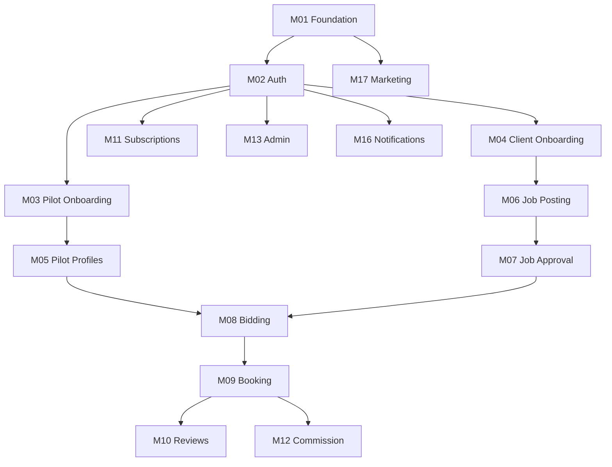

# Build Control — Drone Pilot Marketplace

Master build control table for tracking modules, status, and sprint alignment. Update this file when a module changes state or ownership.

**Status values:** Not Started | In Progress | Blocked | Ready for Review | Approved | Done

| Module ID | Module Name | Description | Status | Priority | Owner | Dependencies | Current Sprint | Notes |
|-----------|-------------|-------------|--------|----------|-------|--------------|----------------|-------|
| M01 | Project Foundation | Next.js app, folder structure, Tailwind, design tokens, base layout, route shells | Done | P0 | — | — | Sprint 1 | Approved — Next.js 16 + Tailwind v4 + route shells |
| M02 | Authentication & User Roles | Signup, login, session, role assignment, protected routes | Done | P0 | — | M01 | Sprint 2 | Auth.js + Prisma User model + middleware role guards |
| M03 | Pilot Onboarding | Pilot registration flow, profile basics, compliance checklist entry | Done | P1 | — | M02 | Sprint 3 | PilotProfile, onboarding, compliance checklist, profile API |
| M04 | Client Onboarding | Client registration flow, company/contact basics | Done | P1 | — | M02 | Sprint 4 | ClientProfile, onboarding, profile API |
| M05 | Pilot Profiles | Public and editable pilot profiles, portfolio, service areas | Ready for Review | P1 | — | M03 | Sprint 13 | /pilots directory, public profile, isPublic toggle |
| M06 | Client Job Posting | Create, edit, submit jobs for marketplace | Done | P1 | — | M04 | Sprint 5 | Job model, draft/submit, client job UI |
| M07 | Job Approval System | Admin review and approve/reject posted jobs | Ready for Review | P1 | — | M06, M13 | Sprint 6 | Admin queue, approve→open, reject+reason |
| M08 | Pilot Bidding / Applications | Pilots browse jobs and submit bids/applications | Ready for Review | P1 | — | M05, M07 | Sprint 7 | JobApplication model, open jobs browse, submit bid |
| M09 | Booking Workflow | Client accepts bid, booking states, assignment lifecycle | Ready for Review | P1 | — | M08 | Sprint 8 | Booking model, accept bid, status flow |
| M10 | Reviews & Ratings | Post-job reviews for pilots and clients | Ready for Review | P2 | — | M09 | Sprint 9 | Review model, post-completion reviews |
| M11 | Pilot Subscriptions | A-1–A-6 tiers, visibility delay, demo enroll | Ready for Review | P1 | — | M02 | Sprint 10 | See M27 — replaces Basic/Pro as primary logic |
| M27 | Pilot Membership Tiers | A-1–A-6 visibility, bidding rules, instructor flag | Ready for Review | P1 | — | M02, M07, M08 | Sprint 25 | `M27_PILOT_MEMBERSHIP_TIERS.md` |
| M12 | Commission System | Platform commission (15% default), calculation and records | Ready for Review | P1 | — | M09, M11 | Sprint 11 | Payment + 15% commission on booking complete; per-pilot override M309 |
| M13 | Admin Dashboard | Admin UI for users, jobs, bookings, settings | Ready for Review | P1 | — | M02 | Sprint 15 | Pilots, bookings, payments, reviews, overview stats |
| M14 | Verification System | Pilot license/cert verification workflow | Ready for Review | P2 | — | M03, M13 | Sprint 16 | Submit docs, admin queue, public verified badges |
| M15 | Digital Wings / Achievements | Wing definitions, auto-assign, admin award, public badges | Ready for Review | P1 | — | M05, M09, M10, M14 | Sprint 23 | Priority 6 — see DEVELOPMENT_ROADMAP.md |
| M26 | Uniform Shop | Pilot catalog/checkout, admin fulfillment, separate payment status | Ready for Review | P2 | — | M02, M03 | Sprint 24 | Priority 7 — see DEVELOPMENT_ROADMAP.md |
| M16 | Notifications / Emails | Transactional email and in-app notifications | Ready for Review | P1 | — | M02 | Sprint 12 | In-app bell + event triggers + dev email log |
| M17 | Public Marketing Pages | Home, For Clients, For Pilots, Pricing, etc. | Ready for Review | P1 | — | M01 | Sprint 14 | Full marketing copy + pricing from DB |
| M18 | Waitlist / Launch Funnel | Pre-launch capture and nurture | Ready for Review | P2 | — | M01 | Sprint 17 | Public signup, admin list, welcome email log |
| M21 | Messaging System | Client–pilot threads linked to job/bid/booking | Ready for Review | P1 | — | M08, M09 | Sprint 18 | Priority 1 — see DEVELOPMENT_ROADMAP.md |
| M22 | Certificate System | Admin templates, PDF issue, pilot downloads | Ready for Review | P1 | — | M03, M13 | Sprint 19 | Priority 2 — see DEVELOPMENT_ROADMAP.md |
| M23 | Dispute Resolution | Booking disputes, moderation, admin payout resolution | Ready for Review | P1 | — | M09, M12, M13 | Sprint 20 | Priority 3 — see DEVELOPMENT_ROADMAP.md |
| M24 | Verification Uploads | PDF/image upload, secure storage, admin document review | Ready for Review | P1 | — | M14, M13 | Sprint 21 | Priority 4 — see DEVELOPMENT_ROADMAP.md |
| M25 | Dashboard Completion | Client/pilot settings, admin dispute stats, achievements hubs | Ready for Review | P1 | — | M02, M13, M23 | Sprint 22 | Priority 5 — see DEVELOPMENT_ROADMAP.md |
| M19 | SEO & Analytics | Meta, sitemap, analytics hooks | Not Started | P2 | — | M17 | — | **Deferred** |
| M20 | QA / Testing / Launch Prep | E2E, accessibility, launch checklist | Not Started | P1 | — | All MVP modules | — | **Deferred** |
| M38 | Client Dashboard Overview API | Live stats, recent projects, activity feed for client home | Not Started | P1 | — | M06, M08, M16 | — | UI mock on `/dashboard/client`; see dashboard-implementation-log |
| M39 | Client Project Bids UI | Compare pilot bids, shortlist/decline/accept (mock state) | In Progress | P1 | — | M08 | — | UI on `/dashboard/client/quotes`; backend pending M52–M57 |
| M40 | Client Activity Feed | Aggregated workspace updates on dashboard | Not Started | P2 | — | M16, M21 | — | Static feed items today |
| M41 | Recommended Pilots Engine | Ranked pilot suggestions for clients | Not Started | P2 | — | M05 | — | Static cards; links to `/pilots` |
| M42 | Client Pilot Card Deep Links | Named mock pilots → real public profile IDs | Not Started | P3 | — | M05 | — | Cards use `/pilots` until seed profiles exist |
| M43 | Multi-Location Project Storage | Persist multiple shoot sites per job | Not Started | P2 | — | M06 | — | UI supports add location; API stores primary only |
| M44 | Reference File Upload | Site plans / mood boards on post-project wizard | Not Started | P2 | — | M24 | — | File picker UI only; no storage |
| M45 | Post-Project Wizard Metadata | Quote type, priority, deliverables as first-class fields | Not Started | P2 | — | M06 | — | Mapped into description/requirements text today |
| M46 | Pilot Matching on Post | Notify/match pilots by service + location | Not Started | P2 | — | M06, M16 | — | Submit uses existing job approval flow |
| M47 | Client Project Detail Page | Dedicated client project overview after post | Not Started | P2 | — | M06 | — | Mock cards link to `/dashboard/client/jobs/[slug]`; DB detail uses job IDs |
| M51 | Client Project Listing API | Paginated client projects with status tab filters | Not Started | P1 | — | M06 | — | My Projects UI uses mock data; `GET /api/client/jobs` exists but not integrated |
| M52 | Client Project Bids API | List bids per client project with status filters | Not Started | P1 | — | M08, M39 | — | Project Bids page uses `project-bids-mock.ts` |
| M53 | Pilot Bid Submission API | Pilots submit offers/bids on open client projects | Not Started | P1 | — | M08 | — | Bid schema + persistence not built |
| M54 | Bid Status Update API | Shortlist, decline, accept bid server-side | Not Started | P1 | — | M52, M53 | — | Accept/decline are local React state today |
| M55 | Booking After Bid Accept | Create booking when client accepts a pilot bid | Not Started | P1 | — | M09, M54 | — | Accept modal notes payment/booking pending |
| M56 | Escrow/Payment After Accept | Payment hold and payout after accepted bid | Not Started | P1 | — | M12, M55 | — | No payment logic on accept |
| M57 | Bid Action Notifications | Notify pilots when bid accepted/declined | Not Started | P2 | — | M16, M54 | — | — |
| M58 | Client Pilot Directory API | Searchable verified pilot listing for client dashboard | Not Started | P1 | — | M05 | — | Find Pilots UI uses `find-pilots-mock.ts` |
| M59 | Pilot Specialty DB Filtering | Category/specialty filters backed by pilot profiles | Not Started | P2 | — | M05, M58 | — | Filter chips are local mock state today |
| M60 | Pilot Availability Data | Availability windows on pilot directory cards | Not Started | P2 | — | M05 | — | Not shown on Find Pilots mock cards |
| M61 | Invite Pilot to Bid | Client invites a pilot to bid on a specific project | Not Started | P2 | — | M06, M53 | — | View profile only; no invite action yet |
| M62 | Chat File Attachments | Upload/send files in client–pilot message threads | Not Started | P2 | — | M21, M24 | — | Paperclip UI placeholder on client Messages page |
| M63 | Pilot Presence Status | Online/offline indicator in message header | Not Started | P3 | — | M21 | — | Static "Pilot · Online" label today |
| M64 | Message Push Notifications | Notify users of new messages in real time | Not Started | P2 | — | M16, M21 | — | — |
| M65 | Stripe Payment Method Management | Add/manage client saved cards via Stripe | Not Started | P1 | — | M12 | — | Billing UI mock card + placeholder Add/Manage |
| M66 | Invoice PDF Download | Generate/download client invoice PDFs | Not Started | P2 | — | M12, M65 | — | PDF buttons placeholder on billing page |
| M68 | Client Notification Preferences API | Persist email/bid/message/project notification toggles | Not Started | P2 | — | M16, M21 | — | localStorage on settings page today |
| M69 | Client Email Notification Service | Send weekly/bid/message/project emails per prefs | Not Started | P2 | — | M16, M68 | — | In-app bell only for now |
| M70 | Pilot Dashboard Overview API | Unified home payload (stats, jobs, activity) | In Progress | P1 | — | M08, M16 | — | UI on `/dashboard/pilot`; `getPilotDashboardPageData` aggregates Prisma |
| M71 | Pilot Recommended Jobs Widget | Ranked job cards on pilot home | In Progress | P1 | — | M08, M70 | — | Uses `listOpenJobsForPilot`; mock when empty |
| M72 | Pilot Proposal Shortlist Tracking | Shortlisted bid status for stats/hero | Not Started | P2 | — | M08 | — | Hero subtext pending; count hardcoded 0 |
| M73 | Pilot On-Time Rate Metric | Completion punctuality for stat card | Not Started | P3 | — | M09 | — | Placeholder 98% when completed jobs > 0 |
| M74 | Pilot Portfolio Completion | Portfolio slots for profile strength checklist | Not Started | P2 | — | M05 | — | Checklist shows PARTIAL 4/8 mock |
| M75 | Pilot Activity Feed Aggregation | Dedicated workspace activity stream | Not Started | P2 | — | M16 | — | Home uses notification list; mock fallback |
| M76 | Rank-Based Locked Job Labels | A-4/A-5 requirement copy on locked rows | Not Started | P2 | — | M27 | — | Live rows show tier delay hours only |
| M77 | Locked Job Countdown Sync | Server-authoritative unlock timers | In Progress | P2 | — | M27 | — | Client countdown from `visibleAt`; mock timers when empty |
| M78 | Pilot Earnings Dashboard API | Monthly deltas, payout history polish | Not Started | P2 | — | M12 | — | Home uses payment sums; link to `/dashboard/pilot/payments` |
| M79 | Pilot Reviews Home Widget | Rating distribution + recent reviews API | In Progress | P2 | — | M10 | — | Prisma top-2; mock when empty |
| M80 | Pilot Marketplace Job Filters | Server search/filter (location, service, budget, rank, distance) | Not Started | P1 | — | M08, M27 | — | UI pills on `/dashboard/pilot/jobs`; local search only |
| M81 | Pilot Marketplace Jobs API Enrichment | Client rating, license rules on list payload | In Progress | P2 | — | M08, M10 | — | `clientDisplayName` added; rating placeholder in UI |
| M82 | Pilot Job Detail Route Polish | Restyle job detail + bid form to mission-control UI | Not Started | P2 | — | M08 | — | Detail route exists; legacy `PageHeader` styling |
| M83 | Pilot Proposal Submission Workflow | End-to-end proposal UX from marketplace CTA | Ready for Review | P1 | — | M08 | — | `PilotBidForm` on `/dashboard/pilot/jobs/[id]` |
| M84 | Pilot Proposal Status Tracking | Shortlist/awaiting states on My Proposals + marketplace | In Progress | P2 | — | M08, M72 | — | UI tabs on `/dashboard/pilot/proposals`; SHORTLISTED mock-only |
| M85 | Marketplace Locked Job Countdown | Live countdown rows on browse page | Not Started | P2 | — | M27, M77 | — | Locked list shows unlock datetime text |
| M86 | Client Rating on Job Cards | Aggregate client rating for marketplace | Not Started | P3 | — | M10, M81 | — | Static 4.9 in mapper until API |
| M87 | Pilot Locked Jobs API | Dedicated locked-jobs list endpoint | Not Started | P2 | — | M27, M08 | — | Uses `lockedJobs` on `GET /api/pilot/jobs` |
| M88 | Locked Job Countdown Service | Server-authoritative unlock + notify | Not Started | P2 | — | M27, M16 | — | Client timer from `visibleAt` today |
| M89 | Certification Eligibility Rules | B2/A3/etc. gates on locked cards | Not Started | P2 | — | M14, M27 | — | Live cards use category/delay labels |
| M90 | Pilot Membership Upgrade Workflow | Paid upgrade unlocks high-tier missions | Not Started | P1 | — | M11 | — | CTA links to subscription demo page |
| M91 | Subscription Payment Integration | Stripe/real payment for tier upgrades | Not Started | P1 | — | M11, M12 | — | Not built |
| M92 | Job Unlock Notifications | Alert pilot when locked job becomes visible | Not Started | P2 | — | M16, M88 | — | — |
| M93 | Pilot Proposals API Enrichment | Shortlisted status, display IDs, client name on list | In Progress | P1 | — | M08 | — | `clientDisplayName` added; shortlisted pending schema |
| M94 | Pilot Proposal Detail Route | `/dashboard/pilot/proposals/[proposalId]` page + data | Not Started | P2 | — | M08, M93 | — | VIEW → uses job detail today |
| M95 | Proposal Shortlisted Status | DB `shortlisted` status + client shortlist action | Not Started | P1 | — | M08, M96 | — | Mock row only on proposals page |
| M96 | Client Bid Review Integration | Client shortlist/reject/accept bids on job offers | Not Started | P1 | — | M08 | — | Client offers route exists; shortlist not wired |
| M97 | Proposal Withdrawal Workflow | Pilot withdraw pending proposal from list/detail | Not Started | P2 | — | M08 | — | `withdrawn` status exists; no UI action |
| M98 | Accepted Proposal to Contract | Accepted bid → active booking/contract workflow | Not Started | P1 | — | M08, M09 | — | Accept API exists; list handoff not built |
| M99 | Proposal Notification Workflow | Notify pilot on shortlist/accept/reject/withdraw | Not Started | P2 | — | M08, M16 | — | — |
| M100 | Pilot Active Contracts API | Enriched contracts list (display IDs, deadlines, recurring) | In Progress | P1 | — | M09 | — | Uses `GET /api/pilot/bookings`; mock when empty |
| M101 | Pilot Contract Detail Route | `/dashboard/pilot/contracts/[contractId]` page + data | Not Started | P2 | — | M09, M100 | — | Deliver/dispute use booking detail today |
| M102 | Deliver Work Upload Workflow | File delivery upload + pilot handoff UX | Not Started | P1 | — | M09 | — | Deliver Work links to booking status actions |
| M103 | Client Handoff Approval Workflow | Client reviews/approves pilot deliverables | Not Started | P1 | — | M09, M102 | — | — |
| M104 | Contract Dispute Workflow | Dispute open/track from contracts grid | In Progress | P2 | — | M09 | — | Links to `BookingDisputeSection` on booking detail |
| M105 | Contract Messaging Integration | Deep link to booking conversation from card | Not Started | P2 | — | M09, M15 | — | Message Client → messages hub |
| M106 | Recurring Contract Billing Logic | Recurring schedule, `/mo` value, status tabs | Not Started | P2 | — | M09, M12 | — | Recurring mock-only on contracts page |
| M107 | Pilot Profile Extended Fields API | Call sign, equipment, languages persistence | Not Started | P2 | — | M05 | — | UI-only local state on profile page |
| M108 | Pilot Avatar Upload Storage | Profile photo upload + public profile image | Not Started | P1 | — | M05 | — | Local preview only today |
| M109 | Pilot Portfolio Upload Storage | Portfolio gallery persistence | Not Started | P1 | — | M05, M122 | — | Gallery page + profile slots use local preview only |
| M110 | Pilot Profile Strength API | Server-side completion % + checklist | Not Started | P2 | — | M05, M14 | — | Client-side calc on profile page |
| M111 | Client Profile Extended Fields API | Role, project prefs, hiring readiness fields | Not Started | P2 | — | M04 | — | UI-only local state on profile page |
| M112 | Client Logo Upload Storage | Company logo upload | Not Started | P2 | — | M04 | — | Local preview only today |
| M113 | Client Onboarding Strength API | Server-side client completion % | Not Started | P2 | — | M04, M12 | — | Client-side calc on profile page |
| M114 | Client Payment Readiness Integration | Payment method connected status on profile | Not Started | P1 | — | M04, M12 | — | PENDING pill on hiring readiness |
| M115 | Pilot Document Type Catalog API | Six document types vs shared `other` + notes | Not Started | P1 | — | M14 | — | Catalog tags in notes workaround |
| M116 | Verification Document Status API | Per-document status endpoint for pilot grid | In Progress | P2 | — | M14 | — | Uses `GET /api/pilot/verifications` |
| M117 | Admin Document Review Notes | Structured rejection reasons on pilot cards | In Progress | P2 | — | M14, M13 | — | `rejectionReason` on rejected cards |
| M118 | Pilot Verification Completion API | Server-side % + pending-action counts | Not Started | P2 | — | M14 | — | Client-side calc + mock fallback |
| M119 | Verification Mission Eligibility | A-4+ / locked job gates from doc approval | Not Started | P1 | — | M14, M27 | — | Notice text only today |
| M120 | Proposal Limit Removal Workflow | Lift proposal caps after verification complete | Not Started | P2 | — | M14, M08 | — | — |
| M121 | Verification Notification Workflow | Notify pilot on approve/reject per document | Not Started | P2 | — | M14, M16 | — | — |
| M122 | Pilot Portfolio API | CRUD portfolio items for pilot gallery | Not Started | P1 | — | M05 | — | Local/mock state on `/dashboard/pilot/portfolio` |
| M124 | Portfolio Item Workflow | Edit/delete/reorder gallery items | Not Started | P2 | — | M122 | — | Add Item local append only |
| M125 | Public Pilot Portfolio Display | Gallery on `/pilots/[id]` + Find Pilots cards | Not Started | P1 | — | M05, M122 | — | — |
| M126 | Portfolio Moderation Workflow | Admin approve/reject portfolio media | Not Started | P2 | — | M122, M13 | — | — |
| M127 | Portfolio Thumbnail Generation | Video/photo preview thumbnails | Not Started | P2 | — | M109 | — | Play icon placeholder for video |
| M128 | Portfolio Completion Calculation | Sync profile strength % from gallery count | Not Started | P2 | — | M122, M110 | — | Profile page uses local slot count |
| M129 | Pilot Reviews Page | Full reviews list UI for pilot dashboard | In Progress | P2 | — | M10, M79 | — | `/dashboard/pilot/reviews`; API + mock fallback |
| M130 | Public Pilot Profile Review Display | Published reviews on `/pilots/[id]` | Not Started | P1 | — | M05, M10 | — | `public.ts` has stats; no review list UI yet |
| M131 | Pilot Reviews Filter/Pagination | All / star / recent filters + paging | Not Started | P2 | — | M129 | — | Full list today; mock shows 5 of 47 |
| M132 | Completed Contract Review CTA | Surface “leave review” on pilot contracts when eligible | Not Started | P2 | — | M09, M10 | — | `canReview` exists on booking detail only |
| M133 | Pilot Payments Page UI | Full earnings/payout history for pilot dashboard | In Progress | P1 | — | M10, M12 | — | `/dashboard/pilot/payments`; API + client CSV export |
| M134 | Stripe Connect Pilot Payouts | Real payout transfers to pilot bank accounts | Not Started | P1 | — | M12 | — | Internal `provider: internal` today |
| M135 | Pilot Payments Filter API | Status/date filters for payout history | Not Started | P2 | — | M133 | — | `All payouts` placeholder only |
| M136 | Pilot Payment CSV Export API | Server-side export for large histories | Not Started | P3 | — | M133 | — | Client-side CSV implemented |
| M137 | Escrow Release Workflow | Release pilot payout after client approval | Not Started | P1 | — | M09, M12 | — | `recordPaymentForCompletedBooking` on complete |
| M138 | Pilot Shop Page UI | Dark uniform/insignia shop for pilot dashboard | In Progress | P1 | — | M26 | — | `/dashboard/pilot/shop`; restyled `PilotUniformShop` |
| M139 | Shop Product Image Management | Upload/store product media per catalog item | Not Started | P1 | — | M26 | — | Marketing rank assets used as fallbacks |
| M140 | Shop Cart Persistence | Save cart across sessions/devices | Not Started | P2 | — | M138 | — | Local React state only |
| M141 | Shop Stripe Checkout | Live payment on uniform orders | Not Started | P1 | — | M26 | — | `POST .../orders/[id]/pay` exists; demo flow |
| M142 | Digital Badge Delivery | NFT/digital wings fulfillment workflow | Not Started | P2 | — | M26 | — | Mock DIGITAL card in empty catalog |
| M143 | Rank-Based Shop Availability | Gate products by pilot membership tier | Not Started | P2 | — | M27, M26 | — | — |
| M144 | Pilot Support Help Center UI | Ground Control help page for pilots | In Progress | P1 | — | M16 | — | `/dashboard/pilot/support` |
| M145 | Help Article CMS/Admin | CRUD help articles for pilot/client audiences | Not Started | P1 | — | M13 | — | Seed module `help-articles.ts` today |
| M146 | Help Article Search API | Server-side article search/indexing | Not Started | P2 | — | M145 | — | Client-side filter on seed data |
| M147 | Role-Based Help Article Visibility | Admin audience targeting per article | Not Started | P2 | — | M145 | — | Typed `audience` field ready |
| M148 | In-Dashboard Support Thread Page | Full-page ticket view (optional vs widget) | Not Started | P3 | — | M16 | — | Widget + event bridge implemented |
| M149 | Support SLA/Priority Workflow | Tier-based queue (A-3 priority copy) | Not Started | P2 | — | M16, M27 | — | Informational subtext only |
| M150 | Pilot Settings Page UI | Account settings layout for pilots | Done | P1 | — | M25 | — | `/dashboard/pilot/settings` |
| M151 | Pilot Notification Preferences | Per-category pilot notification toggles + API | Not Started | P2 | — | M16, M150 | — | Only mark-all-read integrated today |
| M152 | Pilot Payout Settings Backend | Stripe Connect status in settings | Not Started | P1 | — | M12, M134 | — | Links to payments/subscription only |
| M153 | Account Deactivation Workflow | 30-day deactivate → reactivate → delete | Not Started | P1 | — | M02 | — | Modal records mock success only |
| M154 | Deactivation Email Notifications | Notify on deactivate/reactivate/delete | Not Started | P2 | — | M153 | — | — |
| M155 | Account Lifecycle Admin Audit | Admin log for deactivate/delete actions | Not Started | P2 | — | M153, M13 | — | — |
| M156 | Admin Dashboard UI Pass | Aviation-grade restyle of admin/moderator shell + pages | In Progress | P1 | — | M13 | — | Operations, Reports, Users, Job Approval, Messages, Support Chat, Disputes done; remaining modules pending |
| M157 | Admin Reports Module | KPI/reporting page + export APIs | In Progress | P1 | — | M13 | — | `/dashboard/admin/reports` UI done |
| M158 | Admin CMS — Help Articles | CRUD for in-dashboard help content | Not Started | P1 | — | M145, M13 | — | Replaces `help-articles.ts` seed |
| M159 | Admin CMS — Resources | CRUD for public `/resources` articles | Not Started | P1 | — | M158, M13 | — | Replaces `resources-content.ts` seed |
| M160 | Admin Nav Realignment | Sidebar groups match product module list | Done | P2 | — | M156 | — | 15-item menu; stub pages for Reports + CMS |
| M161 | Admin Commissions View | Dedicated commission summary (optional split from payments) | Not Started | P2 | — | M12, M13 | — | Today in payments panel only |
| M162 | Admin Platform Metrics API | Dedicated operations dashboard stats endpoint | Not Started | P2 | — | M13, M156 | — | Inline Prisma in page data loader today |
| M163 | Moderator Operations Queue API | Role-scoped critical action queue | Not Started | P2 | — | M156 | — | Shared queue; moderator limits TBD |
| M164 | Platform Growth Analytics API | Time-series missions + onboarding endpoint | Not Started | P2 | — | M162 | — | Computed in `operations-dashboard-data.ts` |
| M165 | System Health Monitoring API | Uptime/latency/errors for integrity card | Not Started | P3 | — | M156 | — | Display-only values today |
| M166 | Recent Sign-ups Admin Feed API | Paginated new client/pilot signups | Not Started | P2 | — | M13 | — | Top 4 clients inline query today |
| M167 | Admin Export/Reporting Backend | Server-side report generation | Not Started | P2 | — | M157, M156 | — | Client CSV export only |
| M168 | Briefing/Announcement Management | New briefing workflow for command center | Not Started | P2 | — | M156 | — | Placeholder modal |
| M169 | Flagged Mission Investigation | Geo-fence / mission flag workflow | Not Started | P2 | — | M23 | — | Disputes used as proxy in queue |
| M170 | Role-Based Admin/Moderator Permissions | Fine-grained module gating post-design | Not Started | P1 | — | M156 | — | Revenue/export hidden for moderator |
| M171 | Admin Reports Analytics API | Dedicated reports payload endpoint | Not Started | P2 | — | M157 | — | Inline Prisma loader today |
| M172 | Revenue Analytics Backend | Time-series revenue/profit aggregation service | Not Started | P2 | — | M171 | — | Commission used as operating profit |
| M173 | Mission Volume Analytics Backend | Monthly completed mission series API | Not Started | P2 | — | M171 | — | Used in moderator chart |
| M174 | Client Acquisition Analytics Backend | New client QTD/QoQ metrics API | Not Started | P2 | — | M171 | — | Inline count today |
| M175 | Pilot Onboarding Analytics Backend | Onboarding completion metrics API | Not Started | P2 | — | M171 | — | Inline count today |
| M176 | Mission Category Segmentation Report | Full segmentation detail page/route | Not Started | P2 | — | M157 | — | Placeholder link in UI |
| M177 | Analytics Data Sync Status API | Server-authoritative sync timestamp | Not Started | P3 | — | M157 | — | Client UTC ticker today |
| M178 | Admin Fleet & Personnel UI | User management directory page | Done | P1 | — | M13 | — | `/dashboard/admin/users` |
| M179 | Admin User Management API | Enriched personnel directory endpoint | Not Started | P2 | — | M178 | — | Inline Prisma loader today |
| M180 | User Invite Workflow | Invite email + account provisioning | Not Started | P1 | — | M178 | — | Placeholder modal only |
| M181 | User Detail/Edit Routes | Per-user admin view/edit pages | Not Started | P2 | — | M178 | — | Links to pilots/clients lists |
| M182 | Personnel Filter Backend | Server role/region/status filters | Not Started | P2 | — | M179 | — | Client-side filter today |
| M183 | Roster CSV Export Backend | Server-generated personnel export | Not Started | P2 | — | M178 | — | Client CSV export only |
| M184 | Moderator User Directory Permissions | Fine-grained read/edit gating | Not Started | P1 | — | M178, M170 | — | Edit hidden for moderator |
| M185 | Admin Job Approval Queue UI | Aviation-themed pending missions queue | Done | P1 | — | M07, M13 | — | `/dashboard/admin/jobs`; aliases `/admin/jobs/approval`, `/moderator/jobs/approval` |
| M186 | Admin Job Approval Queue API | Dedicated pending-missions payload endpoint | Not Started | P2 | — | M185, M07 | — | Inline `job-approval-queue.ts` loader today |
| M187 | Moderator Job Approval Permissions | Escalate-only vs approve/reject gating | Not Started | P1 | — | M185, M170 | — | Moderator has full approve/reject via `requireAdminSession` |
| M188 | Job Risk Scoring Service | Server high-risk flagging for approval queue | Not Started | P1 | — | M07, M185 | — | Client heuristic (budget/category/night) only |
| M189 | Admin Job Review Detail UI | Restyle `/dashboard/admin/jobs/[id]` to mission-control theme | Not Started | P2 | — | M185 | — | `AdminJobReview` logic preserved; legacy shell |
| M190 | Job Rejection Policy Catalog | Structured policy violation reasons on reject | Not Started | P2 | — | M07 | — | Free-text `reason` min 5 chars today |
| M191 | Job Approval Audit Log | Admin/moderator approve/reject audit trail | Not Started | P2 | — | M07, M13 | — | — |
| M192 | Job Release Notification | Client notified when job approved to pilot network | In Progress | P2 | — | M07, M16 | — | Approve API triggers notification; verify reject path |
| M193 | Job Rejection Notification | Client notified when job rejected with reason | Not Started | P2 | — | M07, M16 | — | — |
| M194 | Approval Queue Filters API | Server risk/region/budget/service/date filters | Not Started | P2 | — | M186 | — | Client risk dropdown only |
| M195 | Approval Queue Pagination API | Server-side paging for pending missions | Not Started | P2 | — | M186 | — | Client 4/page slice; demo total 9 |
| M196 | Admin Messages Tracking UI | Read-only client–pilot conversation inbox | Done | P1 | — | M21, M13 | — | `/dashboard/admin/messages`; no composer |
| M197 | Admin Conversation Search API | Server-side search across conversations | Not Started | P2 | — | M196 | — | Client-side filter on loaded list today |
| M198 | Admin Conversation Filters API | Server job/date/role filters on list endpoint | Not Started | P2 | — | M196 | — | Client-side filters only |
| M199 | Admin Read-only Permissions Audit | Enforce/log admin transcript views | Not Started | P2 | — | M196, M170 | — | `requireAdminSession` gates API today |
| M200 | Admin Transcript Attachment Preview | Render message attachments in read-only view | Not Started | P3 | — | M21, M196 | — | Attachments not in admin message payload |
| M201 | Admin Conversation Unread Indicators | Unread state on admin conversation list | Not Started | P3 | — | M21, M196 | — | `unreadCount` not exposed to admin list API |
| M202 | Admin Support Chat UI | Aviation-themed support inbox + thread | Done | P1 | — | M16, M13 | — | `/dashboard/admin/support`; widget unchanged |
| M203 | Admin Support Search API | Server-side support chat search | Not Started | P2 | — | M202 | — | Client-side filter on loaded list today |
| M204 | Admin Support Filters API | Server role/date/category filters | Not Started | P2 | — | M202 | — | Status filter via API; role/date client-side |
| M205 | Support Ticket Priority/Category | Priority/category fields on support chats | Not Started | P2 | — | M16 | — | Not in admin list DTO |
| M206 | Support Admin View Audit | Log admin/moderator support thread views | Not Started | P3 | — | M202, M170 | — | — |
| M207 | Admin Dispute Center UI | Aviation-themed dispute list + detail workflow | Done | P1 | — | M23, M13 | — | `/dashboard/admin/disputes` |
| M208 | Dispute Priority Scoring Service | Server priority/SLA risk for disputes | Not Started | P2 | — | M207, M23 | — | Client heuristic only |
| M209 | Squadron Voting Workflow | Escalated dispute panel voting | Not Started | P2 | — | M207, M23 | — | Placeholder modal only |
| M210 | Dispute SLA Tracking API | 72h resolution SLA metrics | Not Started | P2 | — | M207 | — | Inline Prisma stats loader |
| M211 | Dispute Satisfaction Analytics | Real satisfaction score from outcomes | Not Started | P3 | — | M210 | — | Approximate % in stats card |
| M212 | Pilot Disputes Dashboard UI | Pilot dispute list/detail pages | Not Started | P1 | — | M23 | — | Client UI exists; pilot API entries only |
| M213 | Dispute Notification Workflow | Notify parties on status/comments/resolve | Not Started | P2 | — | M23, M16 | — | Partial via existing notify hooks |
| M214 | Dispute Audit Log | Admin/moderator action audit trail | Not Started | P2 | — | M207, M23 | — | — |
| M215 | Dispute Evidence Upload Polish | Themed attachment UX on dispute entries | Not Started | P3 | — | M23 | — | URL attachments in timeline today |
| M216 | Stripe Product/Price Mapping | Store Stripe IDs on `SubscriptionPlan` + admin fields | Not Started | P1 | — | M27, M29 | — | Schema has no Stripe columns today |
| M217 | Stripe Subscription Sync | Admin “Sync Stripe” + checkout price alignment | Not Started | P1 | — | M216, M29 | — | Demo enroll only |
| M218 | Proposal Limit Enforcement | Enforce tier proposal/month limits in applications API | Not Started | P2 | — | M27 | — | Marketing copy only today |
| M219 | Editable Commission Settings | Admin-configurable platform commission rate | Not Started | P2 | — | M13 | — | Fixed 10% constant |
| M220 | Tier Analytics / Churn API | Real MRR growth % and churn for admin stats | Not Started | P2 | — | M27 | — | Churn mocked in Phase 33 |
| M221 | Plan Change Audit Log | Audit trail for admin tier/pricing edits | Not Started | P2 | — | Phase 33 | — | PATCH API has no audit |
| M222 | Marketing Pricing DB Sync | Align `/pricing` static copy with DB tier source | Not Started | P3 | — | M27 | — | `PRICING_PLANS` still static |
| M223 | Admin Payout Execution Workflow | Process pending pilot payouts after 10% fee | Not Started | P1 | — | M12, Phase 34 | — | Run Payouts is placeholder only |
| M224 | Stripe Connect Payout Integration | Live payout rails for pilot earnings | Not Started | P1 | — | M223 | — | Internal/demo payments today |
| M225 | Payout Status Tracking | Track pending/settled/held payout lifecycle | Not Started | P2 | — | M223 | — | Commission status mapped heuristically |
| M226 | Commission CSV Export Backend | Server-side ledger export + audit | Not Started | P3 | — | Phase 34 | — | Client-side export only |
| M227 | Ledger Filtering Backend | Server pagination/filter for commission ledger | Not Started | P3 | — | Phase 34 | — | Client-side filters only |
| M228 | Payment Reconciliation Audit Log | Immutable admin payout/commission audit trail | Not Started | P2 | — | M12 | — | — |
| M229 | Commission Analytics Growth API | Real MTD/churn growth % for admin stats | Not Started | P3 | — | Phase 34 | — | Mock growth when sparse data |
| M230 | Admin Payout Permissions Matrix | Explicit moderator read-only vs super-admin run | Not Started | P2 | — | Phase 34 | — | Run hidden for non–super-admin |
| M231 | Certificate Trigger Engine | Auto-issue on mission/hours/tier/safety milestones | Not Started | P1 | — | M22, Phase 35 | — | Manual issue only today |
| M232 | Certificate QR Verification Route | Public/admin verify certificate by ID | Not Started | P1 | — | M22 | — | Preview shows sample ID only |
| M233 | Certificate Email Delivery | Email PDF copy on auto/manual issue | Not Started | P2 | — | M22, M16 | — | Dashboard notification only |
| M234 | Certificate Analytics API | Real PDF render timing + growth metrics | Not Started | P3 | — | Phase 35 | — | Render time label static |
| M235 | Certificate Issuing Audit Log | Immutable admin issue/template change log | Not Started | P2 | — | M22 | — | — |
| M236 | Automated Template Metadata | DB fields for trigger type, delivery flags | Not Started | P2 | — | M22 | — | Display meta in lib layer |
| M237 | Pilot Dashboard Certificate Delivery | Auto-push issued certs to pilot UI | Partial | P2 | — | M22 | — | Manual issue + list exists |
| M238 | Public Profile Certificate Gallery | Show issued certs on `/pilots/[id]` | Not Started | P2 | — | M05, M22 | — | Out of scope in M22 |
| M239 | Certificate Template Permissions Matrix | Moderator read-only vs super-admin CRUD | Partial | P2 | — | Phase 35 | — | Super admin CRUD enforced |
| M240 | Signed Certificate Platform Branding | PDF + preview aligned to RAS aviation theme | Not Started | P3 | — | M22 | — | Generic pdfkit layout today |
| M241 | Badge Rarity Schema Field | Persist LEGENDARY/RARE/EPIC/COMMON on `WingDefinition` | Not Started | P2 | — | Phase 36 | — | Rarity derived in lib layer today |
| M242 | Badge Analytics API | Real 30d awarded growth, most/rarest from live aggregates | Partial | P3 | — | Phase 36 | — | Prisma counts; mock when sparse |
| M243 | Badge Automation Trigger Engine | First bid, night ops, flight hours, founding member triggers | Partial | P2 | — | M wings | — | Some rules exist; gaps documented |
| M244 | Badge Assignment Audit Log | Persist assignment notes, admin actor, timestamps | Not Started | P2 | — | Phase 36 | — | Manual grant works; notes preview-only |
| M245 | Badge Icon / Media Management | Uploadable badge assets vs emoji `iconLabel` | Not Started | P3 | — | Phase 36 | — | Emoji iconLabel today |
| M246 | Role-Based Badge Management Permissions | Moderator read-only vs super-admin CRUD/assign | Partial | P2 | — | Phase 36 | — | Super admin only today |
| M247 | Public Pilot Profile Badge Display Polish | Align wing badges to Figma on `/pilots/[id]` | Not Started | P3 | — | M05 | — | Basic wing display exists |
| M248 | Find Pilots Card Badge Display | Show earned wings on client pilot search cards | Not Started | P3 | — | M05 | — | — |
| M249 | Badge Search / Filter Backend | Server-side badge catalog search and filters | Not Started | P3 | — | Phase 36 | — | Client-side filters only |
| M250 | Admin Shop Orders List Page | Full `/admin/shop/orders` route with filters and fulfillment actions | Not Started | P2 | — | M26, Phase 37 | — | Recent orders only on portal |
| M251 | Per-SKU Stock Threshold Schema | Persist low-stock alert threshold on `UniformProductVariant` | Not Started | P2 | — | Phase 37 | — | Fixed threshold (10) in lib today |
| M252 | Shop Revenue Analytics API | Real 30d growth % and AOV from paid orders | Partial | P3 | — | Phase 37 | — | Prisma aggregates; mock when sparse |
| M253 | Product Image Upload / Media | Uploadable product images vs URL-only `imageUrl` | Not Started | P2 | — | M26 | — | URL field in modal today |
| M254 | Admin Order Fulfillment Workflow | Ship/deliver actions UI on orders list (beyond status PATCH) | Partial | P2 | — | M26 | — | PATCH API exists; portal read-focused |
| M255 | Shared Pilot Shop Product Source Refactor | Single display module when DB empty vs mock cards | Not Started | P3 | — | M26 | — | Pilot mock separate from admin mock |
| M256 | Shop Order CSV Export | Admin export of uniform orders | Not Started | P3 | — | M26 | — | — |
| M257 | Role-Based Shop Management Permissions | Moderator fulfillment vs super-admin catalog CRUD matrix | Partial | P2 | — | Phase 37 | — | Enforced on APIs |
| M258 | Stripe Uniform Checkout | Real payment for uniform orders | Not Started | P1 | — | M26 | — | Placeholder pay flow on pilot side |
| M259 | CMS Prisma Persistence | `CmsArticle` / `CmsResource` models and migrations | Not Started | P1 | — | Phase 38 | — | In-memory preview store today |
| M260 | Articles Collection API (DB) | Persist article CRUD to database | Not Started | P1 | — | M259 | — | Preview API only |
| M261 | Resources Collection API (DB) | Persist resource CRUD to database | Not Started | P1 | — | M259 | — | Preview API only |
| M262 | CMS Media / File Upload Storage | S3 or local storage for featured images and resource files | Not Started | P2 | — | Phase 38 | — | URL fields only |
| M263 | Rich Text Editor Integration | Markdown or WYSIWYG for article/resource body | Not Started | P2 | — | Phase 38 | — | Textarea editor today |
| M264 | CMS Categories / Tags Management | Shared taxonomy tables vs free-text fields | Not Started | P2 | — | Phase 38 | — | Free-text category/tags |
| M265 | Public Resources Page CMS Integration | `/resources` consumes published CMS articles | Not Started | P2 | — | M259, M30 | — | Static `resources-content` today |
| M266 | Support Help Center CMS Integration | Pilot help articles from CMS Articles collection | Not Started | P2 | — | M259 | — | `help-articles.ts` seed today |
| M267 | SEO Metadata Rendering from CMS | Public pages use CMS seoTitle/ogImage | Not Started | P3 | — | M265 | — | Fields stored in preview only |
| M268 | Role-Based CMS Permissions Matrix | Moderator read-only vs super-admin CRUD | Partial | P2 | — | Phase 38 | — | Super admin only |
| M269 | CMS Audit Log | Track publish/archive/edit actor and timestamps | Not Started | P2 | — | M259 | — | — |
| M270 | Platform Settings Persistence Backend | Persist fees, security, and integration config | Not Started | P1 | — | Phase 39 | — | Preview/read-only today |
| M271 | Settings Audit Log | Immutable log for platform configuration changes | Not Started | P2 | — | Phase 39 | — | — |
| M272 | Email Template Editor / Persistence | Editable transactional templates with variables | Not Started | P2 | — | Phase 39 | — | Read-only preview modal |
| M273 | Security Settings Backend | 2FA, auto-suspend, IP allowlist, SSO enforcement | Not Started | P1 | — | Phase 39 | — | Disabled toggles only |
| M274 | Admin 2FA Enforcement | Require 2FA for admin roles | Not Started | P1 | — | M273 | — | — |
| M275 | Failed Login Auto-Suspend Workflow | Lock accounts after N failed attempts | Not Started | P2 | — | M273 | — | — |
| M276 | Super Admin IP Allowlist | Restrict super admin access by IP | Not Started | P2 | — | M273 | — | — |
| M277 | Google Workspace SSO | Admin SSO integration | Not Started | P3 | — | M273 | — | — |
| M278 | Integration Health API | Live health checks beyond env key presence | Not Started | P2 | — | Phase 39 | — | Env detection only |
| M279 | CMS Stats API for Configuration | Scheduled count + read time from persisted CMS | Partial | P3 | — | Phase 38, 39 | — | In-memory CMS stats |
| M280 | Platform Config Confirmation Workflow | Real save with audit on confirm | Not Started | P2 | — | Phase 39 | — | Preview modal only |
| M281 | Moderator Permissions Persistence Backend | Prisma models for moderator module/action grants | Not Started | P1 | — | Phase 40 | — | In-memory preview store today |
| M282 | Admin Permission Management API (DB) | Persist PATCH permissions to database with validation | Not Started | P1 | — | M281 | — | Preview PATCH only |
| M283 | Permission Middleware / Server Enforcement | Edge or server guards using stored permissions | Not Started | P1 | — | M281 | — | Layout guard + client checks today |
| M284 | Permission Audit Log | Immutable log of admin permission changes | Not Started | P2 | — | Phase 40 | — | Preview updatedBy only |
| M285 | Super Admin Role Enforcement Matrix | Separate admin vs super_admin if product adds admin role | Not Started | P3 | — | Phase 40 | — | super_admin only today |
| M286 | Route-Level Permission Guards (Server) | Per-page server `requireModuleAccess` helpers | Partial | P2 | — | Phase 40 | — | Client route guard in layout |
| M287 | Action-Level Permission Guards (API) | Enforce canPerform on admin mutation APIs | Not Started | P1 | — | M281 | — | UI-only today |
| M288 | Sidebar Role/Permission Filtering (DB) | Nav filter from persisted permissions | Partial | P2 | — | Phase 40 | — | In-memory config |
| M289 | Permission Preset Management API | Server-side preset templates | Not Started | P2 | — | M281 | — | Client presets in lib |
| M290 | Permission Change Notifications | Notify moderators when access is restricted | Not Started | P3 | — | M284 | — | — |
| M291 | Marketing Inline Hex → Token Migration | Replace remaining hardcoded Figma hex in marketing TSX | Not Started | P3 | — | Phase 41 | — | Home + shell done |
| M292 | Dashboard TSX `ras-*` Class Adoption | Use shared brand classes in dashboard components | Not Started | P3 | — | Phase 41 | — | CSS modules tokenized |
| M293 | Client/Pilot Sub-Route Visual QA | Page-by-page design consistency sign-off | Not Started | P2 | — | Phase 41 | — | — |
| M294 | Figma Design Token Handoff | Align tokens to final Figma variables | Not Started | P2 | — | ADR-009 | — | Interim tokens in globals; client updated Figma — see M320 |
| M295 | Source Document Alignment | Docs from Media Kit, Membership Upgrades, Paragraph 5 PDFs | Done | P0 | — | — | — | NEW_FEATURES_COMPARISON + IMPLEMENTATION_CONTEXT |
| M296 | Default 15% Commission Alignment | Code + docs use 15% default; remove 10% assumptions | In Progress | P1 | — | M12 | — | Constant updated; per-pilot override = M309 |
| M297 | Annual Membership Billing | $99.99/year base membership (all pilots) | Not Started | P1 | — | M11 | — | Replaces per-tier monthly model in UI |
| M298 | Fast Forward One-Time Upgrades | A-2–A-6 one-time upgrade fees (not recurring tiers) | Not Started | P1 | — | M297 | — | Separate from membership SKU |
| M299 | Upgrade Difference Calculation | Charge only delta when upgrading Fast Forward again | Not Started | P1 | — | M298 | — | Example $129.99 − $89.99 = $40 |
| M300 | Membership Lapse Handling | Stop grade time; deactivate benefits/verification | Not Started | P1 | — | M297 | — | On expired annual membership |
| M301 | 30-Day Profile Reactivation | Retain grade if reactivated within 30 days of cancel | Not Started | P1 | — | M300 | — | Warn on account deletion |
| M302 | Automatic Grade Promotion Engine | Time-based A-1→A-6 for active members in good standing | Not Started | P1 | — | M27 | — | Pauses when lapsed |
| M303 | Job Visibility Delay Engine | Enforce 48/36/24/12/6/0h after admin approval | Partial | P1 | — | M27, M07 | — | Backend largely done; verify on wire |
| M304 | Proposal Eligibility by Grade | Block A-1 from submitting proposals | Partial | P1 | — | M08, M27 | — | `canApply: false` in tiers |
| M305 | Proposal Revision 20% Limit | Cap bid revision price increase at +20% | Not Started | P1 | — | M08 | — | Media Kit flow |
| M306 | Client-Initiated Chat Rule | Only clients may start client–pilot job threads | Not Started | P1 | — | M21 | — | Enforce in messaging API |
| M307 | Booking Contract Milestone Fields | Six stages + operation planning fields on booking | Not Started | P2 | — | M09 | — | Flight times, angles, delivery, etc. |
| M308 | Escrow Payment Flow | Collect, hold, release on completion minus commission | Not Started | P1 | — | M12, M56 | — | No fake Stripe UI |
| M309 | Per-Pilot Commission Override | Super Admin manual commission rate per pilot | Not Started | P2 | — | M296 | — | Paragraph 5 |
| M310 | Commission Buyout (A-4+) | Optional buyout of platform commission | Not Started | P3 | — | M309 | — | Post-launch; 75% of 6mo or flat |
| M311 | Uniform Policy Acceptance | Require acceptance at signup/profile activation | Not Started | P2 | — | M03 | — | Media Kit governance |
| M312 | Uniform Compliance Client Review | Client asks if pilot wore proper uniform | Not Started | P2 | — | M10, M311 | — | Post-job review question |
| M313 | Admin Sanction Controls | Demotion, visibility, job access, termination | Not Started | P2 | — | M13, M311 | — | Uniform violation path |
| M314 | Rule-Driven Wings/Awards Engine | Hour/cert/contract rules + admin award | Not Started | P2 | — | M15 | — | Senior/Master wings criteria |
| M315 | Certificate & ID Card Module | Digital cert free; ID mailed after 30 approved days | Not Started | P2 | — | M22, M297 | — | Templates TBD |
| M316 | Instructor Add-On Module | $199.99/yr; min A-4; student 20% off membership | Not Started | P2 | — | M297 | — | Ceremonial promotion later |
| M317 | Captain's Club Public Page | Alphabetical public list of active A-6 Captains | Not Started | P1 | — | M05, M17 | — | New marketing route |
| M318 | Squadron Vote Dispute Escalation | 100-vote leadership escalation path | Not Started | P3 | — | M23 | — | Post-MVP mediation |
| M319 | Remote Rescue Future Roadmap | Document only — late 2027 | Not Started | P3 | — | — | — | **Do not implement** |
| M320 | Figma Re-Alignment Post Source Docs | Reconcile updated Figma with membership/commission rules | Not Started | P2 | — | M294, M297 | — | After doc alignment |

## Priority legend

- **P0** — Critical path; blocks other work
- **P1** — Required for Phase 1 MVP
- **P2** — Important post-MVP or partial MVP
- **P3** — Enhancement / later phase

## Module dependency overview

## Active workstream

**Functionality wiring phase (current):** UI/design shell complete (dashboard Phases 1–41). Business rules aligned to client source PDFs (see M295). Next: wire mock/preview surfaces to real APIs per [`FUNCTIONALITY_WIRING_PLAN.md`](FUNCTIONALITY_WIRING_PLAN.md) phases 2–10 and [`PLATFORM_MILESTONE_PLAN.md`](PLATFORM_MILESTONE_PLAN.md). **Context:** [`IMPLEMENTATION_CONTEXT_FOR_NEW_FEATURES.md`](IMPLEMENTATION_CONTEXT_FOR_NEW_FEATURES.md). **Start:** Milestone 1 — Client My Projects → Project Bids.

**Polish phase (deferred):** See [`POLISH_IMPLEMENTATION_CHECKLIST.md`](POLISH_IMPLEMENTATION_CHECKLIST.md) for sign-off, placeholder routes, and cross-cutting fixes before SEO/publish.

---

## How to use this table

1. When starting a module, set **Status** to `In Progress` and assign **Owner**.
2. When blocked, set **Status** to `Blocked` and document the blocker in **Notes**.
3. When implementation is complete, set **Status** to `Ready for Review`.
4. After review and sign-off, set **Status** to `Approved`, then `Done` when deployed/merged per sprint policy.
5. Do not start a new module until the current module is **Approved** per `MODULE_WORKFLOW.md`.
