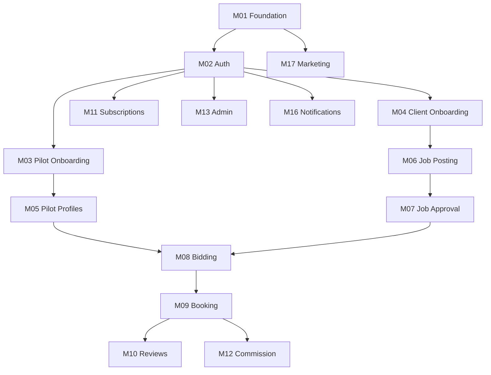

# Build Control — Drone Pilot Marketplace

Master build control table for tracking modules, status, and sprint alignment. Update this file when a module changes state or ownership.

**Status values:** Not Started | In Progress | Blocked | Ready for Review | Approved | Done

| Module ID | Module Name | Description | Status | Priority | Owner | Dependencies | Current Sprint | Notes |
|-----------|-------------|-------------|--------|----------|-------|--------------|----------------|-------|
| M01 | Project Foundation | Next.js app, folder structure, Tailwind, design tokens, base layout, route shells | Done | P0 | — | — | Sprint 1 | Approved — Next.js 16 + Tailwind v4 + route shells |
| M02 | Authentication & User Roles | Signup, login, session, role assignment, protected routes | Done | P0 | — | M01 | Sprint 2 | Auth.js + Prisma User model + middleware role guards |
| M03 | Pilot Onboarding | Pilot registration flow, profile basics, compliance checklist entry | Done | P1 | — | M02 | Sprint 3 | PilotProfile, onboarding, compliance checklist, profile API |
| M04 | Client Onboarding | Client registration flow, company/contact basics | Done | P1 | — | M02 | Sprint 4 | ClientProfile, onboarding, profile API |
| M05 | Pilot Profiles | Public and editable pilot profiles, portfolio, service areas | Ready for Review | P1 | — | M03 | Sprint 13 | /pilots directory, public profile, isPublic toggle |
| M06 | Client Job Posting | Create, edit, submit jobs for marketplace | Done | P1 | — | M04 | Sprint 5 | Job model, draft/submit, client job UI |
| M07 | Job Approval System | Admin review and approve/reject posted jobs | Ready for Review | P1 | — | M06, M13 | Sprint 6 | Admin queue, approve→open, reject+reason |
| M08 | Pilot Bidding / Applications | Pilots browse jobs and submit bids/applications | Ready for Review | P1 | — | M05, M07 | Sprint 7 | JobApplication model, open jobs browse, submit bid |
| M09 | Booking Workflow | Client accepts bid, booking states, assignment lifecycle | Ready for Review | P1 | — | M08 | Sprint 8 | Booking model, accept bid, status flow |
| M10 | Reviews & Ratings | Post-job reviews for pilots and clients | Ready for Review | P2 | — | M09 | Sprint 9 | Review model, post-completion reviews |
| M11 | Pilot Subscriptions | Plans, enrollment, subscription status | Ready for Review | P1 | — | M02 | Sprint 10 | Plans, enroll/cancel, seed Basic on demo pilot |
| M12 | Commission System | Platform commission (10% Phase 1), calculation and records | Ready for Review | P1 | — | M09, M11 | Sprint 11 | Payment + 10% commission on booking complete |
| M13 | Admin Dashboard | Admin UI for users, jobs, bookings, settings | Ready for Review | P1 | — | M02 | Sprint 15 | Pilots, bookings, payments, reviews, overview stats |
| M14 | Verification System | Pilot license/cert verification workflow | Ready for Review | P2 | — | M03, M13 | Sprint 16 | Submit docs, admin queue, public verified badges |
| M15 | Digital Wings / Achievements | Wing definitions, auto-assign, admin award, public badges | Ready for Review | P1 | — | M05, M09, M10, M14 | Sprint 23 | Priority 6 — see DEVELOPMENT_ROADMAP.md |
| M26 | Uniform Shop | Pilot catalog/checkout, admin fulfillment, separate payment status | Ready for Review | P2 | — | M02, M03 | Sprint 24 | Priority 7 — see DEVELOPMENT_ROADMAP.md |
| M16 | Notifications / Emails | Transactional email and in-app notifications | Ready for Review | P1 | — | M02 | Sprint 12 | In-app bell + event triggers + dev email log |
| M17 | Public Marketing Pages | Home, For Clients, For Pilots, Pricing, etc. | Ready for Review | P1 | — | M01 | Sprint 14 | Full marketing copy + pricing from DB |
| M18 | Waitlist / Launch Funnel | Pre-launch capture and nurture | Ready for Review | P2 | — | M01 | Sprint 17 | Public signup, admin list, welcome email log |
| M21 | Messaging System | Client–pilot threads linked to job/bid/booking | Ready for Review | P1 | — | M08, M09 | Sprint 18 | Priority 1 — see DEVELOPMENT_ROADMAP.md |
| M22 | Certificate System | Admin templates, PDF issue, pilot downloads | Ready for Review | P1 | — | M03, M13 | Sprint 19 | Priority 2 — see DEVELOPMENT_ROADMAP.md |
| M23 | Dispute Resolution | Booking disputes, moderation, admin payout resolution | Ready for Review | P1 | — | M09, M12, M13 | Sprint 20 | Priority 3 — see DEVELOPMENT_ROADMAP.md |
| M24 | Verification Uploads | PDF/image upload, secure storage, admin document review | Ready for Review | P1 | — | M14, M13 | Sprint 21 | Priority 4 — see DEVELOPMENT_ROADMAP.md |
| M25 | Dashboard Completion | Client/pilot settings, admin dispute stats, achievements hubs | Ready for Review | P1 | — | M02, M13, M23 | Sprint 22 | Priority 5 — see DEVELOPMENT_ROADMAP.md |
| M19 | SEO & Analytics | Meta, sitemap, analytics hooks | Not Started | P2 | — | M17 | — | **Deferred** |
| M20 | QA / Testing / Launch Prep | E2E, accessibility, launch checklist | Not Started | P1 | — | All MVP modules | — | **Deferred** |

## Priority legend

- **P0** — Critical path; blocks other work
- **P1** — Required for Phase 1 MVP
- **P2** — Important post-MVP or partial MVP
- **P3** — Enhancement / later phase

## Module dependency overview

## Active workstream

**Polish phase (not M19/M20):** See [`POLISH_IMPLEMENTATION_CHECKLIST.md`](POLISH_IMPLEMENTATION_CHECKLIST.md) for sign-off, placeholder routes, and cross-cutting fixes before SEO/publish.

---

## How to use this table

1. When starting a module, set **Status** to `In Progress` and assign **Owner**.
2. When blocked, set **Status** to `Blocked` and document the blocker in **Notes**.
3. When implementation is complete, set **Status** to `Ready for Review`.
4. After review and sign-off, set **Status** to `Approved`, then `Done` when deployed/merged per sprint policy.
5. Do not start a new module until the current module is **Approved** per `MODULE_WORKFLOW.md`.
