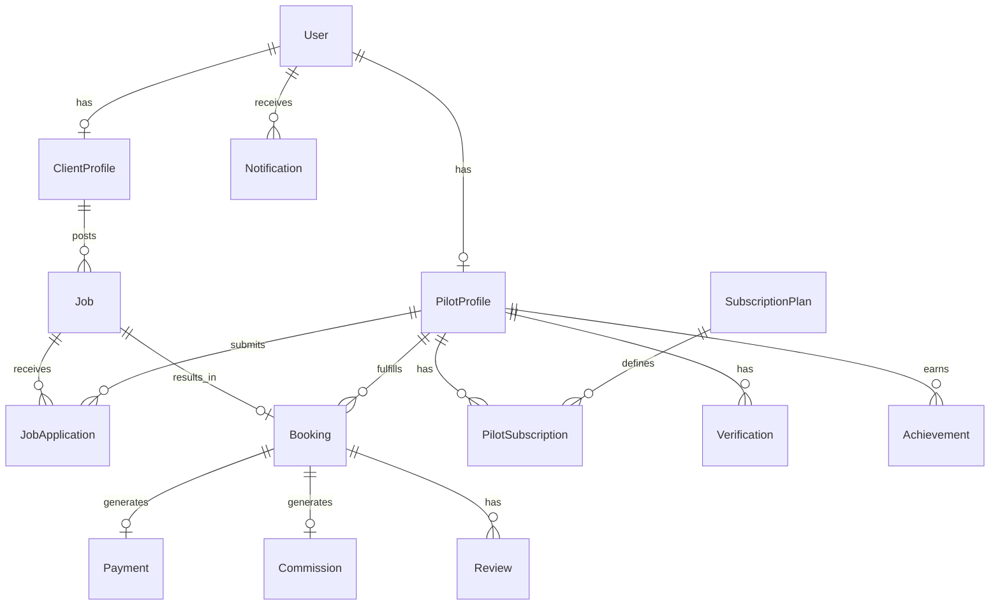

# Data Model Overview — v1 (Planning)

Conceptual data model for Phase 1. **No database migrations yet** — this document guides schema design when foundation setup begins.

---

## Entity relationship (high level)

---

## User

**Purpose:** Core identity and authentication; links to role-specific profiles.

| Key fields | Type / notes |
|------------|----------------|
| id | UUID |
| email | Unique, required |
| passwordHash | Or external auth provider id |
| role | `client` \| `pilot` \| `moderator` \| `super_admin` |
| status | See status values |
| emailVerifiedAt | Timestamp |
| createdAt, updatedAt | Timestamps |

**Relations:** One optional `PilotProfile`, one optional `ClientProfile`, many `Notification`.

**Status values:** `pending` | `active` | `suspended` | `deleted`

---

## PilotProfile

**Purpose:** Public and private pilot marketplace identity, skills, and compliance hooks.

| Key fields | Type / notes |
|------------|----------------|
| id | UUID |
| userId | FK → User |
| displayName | Required |
| bio | Text |
| avatarUrl | String |
| location | City, region, country |
| serviceRadiusKm | Number |
| servicesOffered | Array / tags (e.g. real estate, inspection) |
| hourlyRateMin, hourlyRateMax | Optional |
| portfolioJson | JSON array of flight-gallery items (`PilotPortfolioItem`) |
| profileExtrasJson | JSON: call sign, languages, drones, payloads, extra chips, avatar data-URL |
| licenseNumber | String |
| isPublic | Boolean |
| commissionOverrideEnabled | Boolean — Super Admin per-pilot commission override active |
| commissionOverrideRate | Float? — override rate as fraction (e.g. 0.075) |
| commissionOverrideReason | String? — reason/context for the override |
| commissionOverrideEffective | String? — free-text effective date/label |
| instructorAddonActive | Boolean — Remote Pilot Instructor add-on (demo until Stripe) |
| instructorAddonPeriodEnd | DateTime? |
| instructorDiscountCode | Unique student code (20% off $99.99 membership) |
| referredByInstructorId | FK → PilotProfile — student linked via instructor code |

**Relations:** User (1:1), JobApplications, Bookings, Verifications, Achievements, PilotSubscriptions, InstructorWingRequests, instructor students.

**Commission override:** Set from Configuration → Custom Pilot Rates (Super Admin, `configuration.manageSettings`). Applied at payout by `getEffectiveCommissionRateForPilot` (override → persisted platform default → 15%).

**Status values:** `draft` | `pending_review` | `approved` | `rejected` | `suspended`

---

## ClientProfile

**Purpose:** Client identity for job posting and billing contact.

| Key fields | Type / notes |
|------------|----------------|
| id | UUID |
| userId | FK → User |
| companyName | Optional |
| contactName | Required |
| phone | Optional |
| billingAddress | Optional JSON |

**Relations:** User (1:1), Jobs.

**Status values:** `active` | `suspended` (inherits from User where applicable)

---

## Job

**Purpose:** Client-requested drone work listing after approval visible to pilots.

| Key fields | Type / notes |
|------------|----------------|
| id | UUID |
| clientProfileId | FK → ClientProfile |
| title | Required |
| description | Required |
| category | Enum / tag |
| location | Address or lat/lng + label |
| scheduledDate | Optional |
| budgetMin, budgetMax | Decimal |
| currency | Default platform currency |
| requirements | Text / JSON (deliverables, FAA notes, etc.) |
| approvedAt, approvedByUserId | Admin approval audit |
| rejectionReason | Text |

**Relations:** ClientProfile, JobApplications, Booking (0:1 active).

**Status values:** `draft` | `pending_approval` | `approved` | `rejected` | `open` | `in_bidding` | `assigned` | `closed` | `cancelled`

---

## JobApplication / Bid

**Purpose:** Pilot proposal on a job (price, message, timeline).

| Key fields | Type / notes |
|------------|----------------|
| id | UUID |
| jobId | FK → Job |
| pilotProfileId | FK → PilotProfile |
| proposedAmount | Decimal |
| currency | String |
| message | Text |
| estimatedDeliveryDate | Date |
| submittedAt | Timestamp |

**Relations:** Job, PilotProfile; accepted application links to Booking.

**Status values:** `submitted` | `withdrawn` | `accepted` | `rejected` | `expired`

---

## Booking

**Purpose:** Confirmed engagement after client accepts a bid.

| Key fields | Type / notes |
|------------|----------------|
| id | UUID |
| jobId | FK → Job |
| jobApplicationId | FK → accepted application |
| pilotProfileId | FK → PilotProfile |
| clientProfileId | FK → ClientProfile |
| agreedAmount | Decimal |
| currency | String |
| scheduledStartAt, scheduledEndAt | Timestamps |
| completedAt | Timestamp |

**Relations:** Job, JobApplication, PilotProfile, ClientProfile, Payment, Commission, Reviews.

**Status values:** `pending` | `confirmed` | `in_progress` | `completed` | `cancelled` | `disputed` (flag only in Phase 1)

---

## SubscriptionPlan

**Purpose:** Defines pilot subscription tiers (Phase 1: basic structure).

| Key fields | Type / notes |
|------------|----------------|
| id | UUID |
| name | e.g. Basic, Pro |
| slug | Unique |
| priceMonthly | Decimal |
| currency | String |
| features | JSON array |
| isActive | Boolean |

**Relations:** PilotSubscriptions.

**Status values:** N/A (use `isActive`)

---

## PilotSubscription

**Purpose:** Pilot enrollment in a plan.

| Key fields | Type / notes |
|------------|----------------|
| id | UUID |
| pilotProfileId | FK → PilotProfile |
| subscriptionPlanId | FK → SubscriptionPlan |
| currentPeriodStart, currentPeriodEnd | Dates |
| externalSubscriptionId | Payment provider reference |

**Relations:** PilotProfile, SubscriptionPlan.

**Status values:** `trialing` | `active` | `past_due` | `cancelled` | `expired`

---

## Payment

**Purpose:** Money movement record for bookings (Phase 1: logical record; gateway integration later).

| Key fields | Type / notes |
|------------|----------------|
| id | UUID |
| bookingId | FK → Booking |
| payerUserId | FK → User (client) |
| payeeUserId | FK → User (pilot) |
| amountGross | Decimal |
| amountNet | Decimal |
| currency | String |
| provider | e.g. stripe |
| providerPaymentId | String |

**Relations:** Booking, Commission (optional 1:1).

**Status values:** `pending` | `processing` | `succeeded` | `failed` | `refunded`

---

## Commission

**Purpose:** Platform fee (**15% default** per source PDFs) on qualifying transactions.

| Key fields | Type / notes |
|------------|----------------|
| id | UUID |
| bookingId | FK → Booking |
| paymentId | FK → Payment (optional) |
| rate | Decimal (default 0.15) |
| amount | Decimal |
| currency | String |
| calculatedAt | Timestamp |

**Relations:** Booking, Payment.

**Status values:** `calculated` | `invoiced` | `collected` | `waived`

---

## Review

**Purpose:** Post-completion trust signal.

| Key fields | Type / notes |
|------------|----------------|
| id | UUID |
| bookingId | FK → Booking |
| authorUserId | FK → User |
| targetPilotProfileId or targetClientProfileId | Polymorphic target |
| rating | 1–5 |
| comment | Text |
| createdAt | Timestamp |

**Relations:** Booking, User, PilotProfile / ClientProfile.

**Status values:** `published` | `hidden` | `flagged`

---

## Verification

**Purpose:** Pilot license/cert and identity checks.

| Key fields | Type / notes |
|------------|----------------|
| id | UUID |
| pilotProfileId | FK → PilotProfile |
| type | `license` \| `insurance` \| `identity` \| `other` |
| documentUrl | String |
| submittedAt, reviewedAt | Timestamps |
| reviewedByUserId | FK → User (admin) |
| notes | Text |

**Relations:** PilotProfile, User (reviewer).

**Status values:** `pending` | `approved` | `rejected` | `expired`

---

## Achievement / Wing

**Purpose:** Digital wings and milestones (M15; fields defined for future consistency).

| Key fields | Type / notes |
|------------|----------------|
| id | UUID |
| pilotProfileId | FK → PilotProfile |
| code | e.g. `first_flight`, `ten_jobs` |
| title, description | Strings |
| earnedAt | Timestamp |
| metadata | JSON |

**Relations:** PilotProfile.

**Status values:** N/A (immutable once earned)

---

## Notification

**Purpose:** In-app and email-trigger records.

| Key fields | Type / notes |
|------------|----------------|
| id | UUID |
| userId | FK → User |
| type | Enum (job_approved, bid_received, etc.) |
| channel | `in_app` \| `email` |
| title, body | Strings |
| payload | JSON |
| readAt | Timestamp |
| sentAt | Timestamp |

**Relations:** User.

**Status values:** `pending` | `sent` | `failed` | `read`

---

## Phase 1 modeling notes

- One **active Booking** per Job in Phase 1 (single accepted bid).
- **Commission** calculated as `agreedAmount * 0.15` unless overridden per pilot (Super Admin — M309).
- **Guest** is not an entity; no User row until registration.
- API responses should expose stable ids for future mobile clients without coupling to UI.
