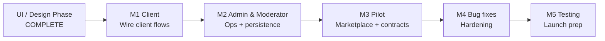
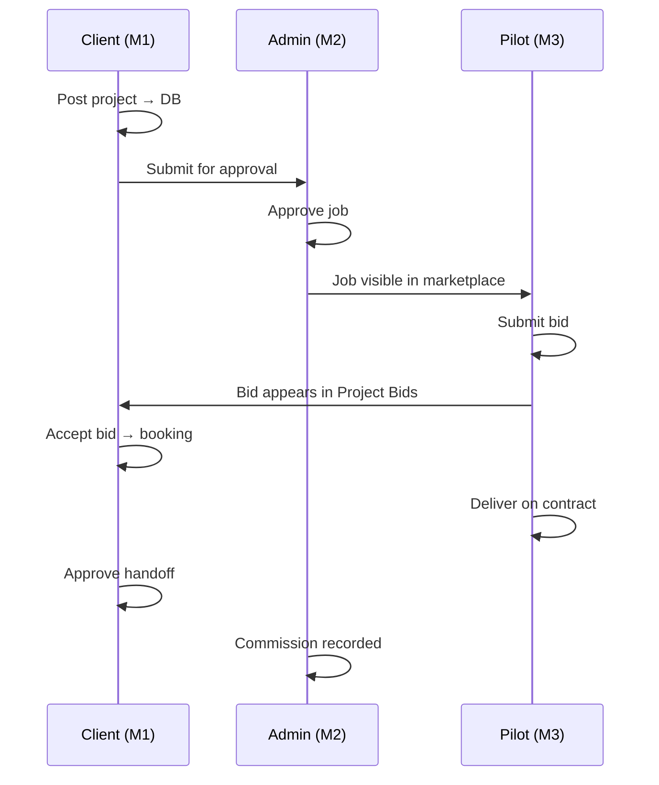

# Remote Air Service — Platform Milestone Plan

**Purpose:** Shareable roadmap for the team — what is done, what comes next, and how we deliver work in five milestones.

**Last updated:** 2026-06-02  
**Product:** Drone Pilot Marketplace (Remote Air Service)  
**Stack:** Next.js 16 · Tailwind v4 · Prisma · Auth.js · PostgreSQL

**Related docs:** [`BUILD_CONTROL.md`](BUILD_CONTROL.md) · [`FUNCTIONALITY_WIRING_PLAN.md`](FUNCTIONALITY_WIRING_PLAN.md) · [`dashboard-implementation-log.md`](dashboard-implementation-log.md)

---

## How to read this document

Each milestone is a **delivery bucket**, not a single sprint. Within each milestone we list:

| Column | Meaning |
|--------|---------|
| **Area** | Product surface (route, module, or flow) |
| **UI** | Screen design / layout status |
| **Functionality** | Real API + database wiring status |
| **Owner lane** | Who primarily owns the work |
| **BUILD ID** | Module reference in `BUILD_CONTROL.md` |

**Status tags**

| Tag | Meaning |
|-----|---------|
| ✅ **Done** | Shipped and usable |
| 🎨 **UI done** | Screen built; may still use mock/preview data |
| 🔌 **Partial** | Some APIs wired; gaps remain |
| 📋 **Planned** | Not started in this milestone |
| ⏸ **Deferred** | Explicitly later (payments, Figma final, etc.) |

---

## Executive summary

### What we finished (UI / design phase)

We completed an **interim foundation** across the whole platform:

- Public marketing and legal pages
- Client, pilot, admin, and moderator dashboards (40+ dashboard phases)
- Unified design system (black / white / gold aviation theme)
- Role-based navigation, shell, and moderator permission UI
- Preview APIs and mock data layers so every screen is demonstrable

### What we are doing now (functionality phase)

We are **wiring UI to real backends** — no redesign, no fake payments, no duplicate systems.

Work is organized in **five milestones**:

1. **Milestone 1 — Client** — client posts, lists, reviews bids, finds pilots
2. **Milestone 2 — Admin & Moderator** — approval, ops, disputes, persistence for admin tools
3. **Milestone 3 — Pilot** — marketplace, proposals, contracts, handoff
4. **Milestone 4 — Bug fixes & hardening** — cross-role defects, edge cases, performance
5. **Milestone 5 — Testing & launch prep** — E2E, accessibility, SEO, go-live checklist

Payments (Stripe), full upload storage, and final Figma alignment sit **after** core marketplace wiring unless noted.

---

## Platform inventory — done so far

### Foundation & auth ✅

| Area | UI | Functionality | Notes |
|------|----|---------------|-------|
| Next.js app, routing, middleware | ✅ | ✅ | M01 |
| Register / login / sessions / roles | ✅ | ✅ | M02 — email, password, role only on register |
| Client onboarding | ✅ | ✅ | M04 |
| Pilot onboarding | ✅ | ✅ | M03 |
| Protected routes by role | ✅ | ✅ | client · pilot · admin · moderator · super_admin |

### Public / marketing 🎨

| Page | UI | Functionality |
|------|----|---------------|
| Home | 🎨 | Static/content modules |
| For Clients · For Pilots · How It Works | 🎨 | Static |
| Pricing | 🎨 | Plans from DB where seeded |
| About · Contact · Safety | 🎨 | Static |
| Resources · Privacy · Terms · Cookies | 🎨 | Static / seed content |
| Pilot public directory `/pilots` | 🎨 | 🔌 Prisma-backed when profiles exist |
| Waitlist | 🎨 | ✅ API + admin list |

### Client dashboard 🎨 (functionality next — Milestone 1)

| Route | UI | Functionality |
|-------|----|---------------|
| Overview `/dashboard/client` | 🎨 | Mock stats / activity |
| Post project wizard `/jobs/new` | 🎨 | 🔌 Saves via API; metadata partial |
| My Projects `/jobs` | 🎨 | Mock list |
| Project Bids `/quotes` | 🎨 | Mock + local accept state |
| Find Pilots `/find-pilots` | 🎨 | Mock directory |
| Messages | 🎨 | Mock threads (API exists) |
| Billing | 🎨 | 🔌 Payments API + mock invoices |
| Disputes | 🎨 | 🔌 New UI; API exists |
| Profile · Settings · Onboarding | 🎨 | 🔌 Profile wired; settings localStorage |

### Admin & moderator dashboard 🎨 (Milestone 2)

| Route | UI | Functionality |
|-------|----|---------------|
| Operations home | 🎨 | ✅ Prisma stats |
| Reports & analytics | 🎨 | ✅ Prisma |
| Job approval queue | 🎨 | 🔌 Prisma + mock when empty |
| Fleet & personnel | 🎨 | 🔌 Prisma + mock roster fallback |
| Messages tracking | 🎨 | ✅ Read-only |
| Support chat | 🎨 | ✅ Live |
| Dispute center | 🎨 | 🔌 Prisma + mock stats fallback |
| Subscriptions / tier plans | 🎨 | 🔌 Prisma |
| Commissions ledger | 🎨 | 🔌 Prisma + mock ledger fallback |
| Certificates engine | 🎨 | 🔌 DB + mock templates fallback |
| Badges & wings | 🎨 | 🔌 DB + mock cards fallback |
| Uniform shop admin | 🎨 | 🔌 DB + mock inventory fallback |
| CMS (articles / resources) | 🎨 | Preview in-memory store |
| Platform configuration | 🎨 | Preview read-only |
| Moderator permissions | 🎨 | Preview in-memory store |
| Users · pilots · verifications · payments | 🎨 | ✅ Prisma |

### Pilot dashboard 🎨 (Milestone 3)

| Route | UI | Functionality |
|-------|----|---------------|
| Overview | 🎨 | 🔌 Partial Prisma + mock widgets |
| Marketplace `/jobs` | 🎨 | 🔌 API + mock fallback |
| Locked jobs | 🎨 | 🔌 API + mock fallback |
| My Proposals | 🎨 | 🔌 API + mock fallback |
| Active contracts | 🎨 | 🔌 Bookings API + mock fallback |
| Messages · Portfolio · Reviews | 🎨 | Mock / partial |
| Verifications | 🎨 | 🔌 Upload + admin review exists |
| Payments · Shop · Subscription | 🎨 | Demo / placeholder checkout |
| Support · Settings · Profile | 🎨 | Static help / partial |

### Cross-cutting (built, polish in later milestones)

| System | UI | Functionality |
|--------|----|---------------|
| Messaging (client ↔ pilot) | ✅ | 🔌 Thread API; dashboard UI mock |
| Notifications (in-app bell) | ✅ | 🔌 Events partial |
| Bookings lifecycle | Legacy + new UI | 🔌 Accept API exists |
| Disputes | ✅ | 🔌 Prisma + admin resolution |
| Reviews | ✅ | 🔌 Post-completion |
| Membership tiers A-1–A-6 | ✅ | 🔌 Visibility delay logic |
| Commission 15% | Admin UI | 🔌 Calculation on complete |
| Design system / dashboard theme | ✅ | Phase 41 complete |

---

## Milestone overview



| # | Milestone | Goal | Exit criteria |
|---|-----------|------|---------------|
| **1** | Client | Client can post, track, and act on real projects | End-to-end client path works with DB (except payments) |
| **2** | Admin & Moderator | Ops can approve jobs and run platform with persisted admin data | No preview-only stores on critical admin paths |
| **3** | Pilot | Pilots see approved jobs, bid, contract, deliver | Marketplace loop closed with client Milestone 1 |
| **4** | Bug fixes | Stable cross-role experience | P1/P2 defects closed; no mock on production paths |
| **5** | Testing & launch | Ship-ready quality | E2E pass · a11y · SEO · launch checklist |

---

## Milestone 1 — Client

**Theme:** *“Everything the client sees and does — real data first.”*

**Presentation for team reviews:** Demo only **client routes** under `/dashboard/client`. Use one test client account. Show live DB state in My Projects after each story.

### Scope

| # | Work item | Current | Target | BUILD IDs |
|---|-----------|---------|--------|-----------|
| 1.1 | Post project → save & submit | 🔌 API wired | First-class fields (locations, deliverables, priority) | M06, M43–M45 |
| 1.2 | My Projects list & tabs | Mock | `GET /api/client/jobs` | M51 |
| 1.3 | Project detail page | Partial | Dedicated overview per job | M47 |
| 1.4 | Project Bids — list & filters | Mock | Applications API per project | M52 |
| 1.5 | Shortlist / decline / accept bid | Local state | Server actions + booking on accept | M54–M55, M96–M98 |
| 1.6 | Client dashboard overview | Mock | Live stats, recent projects, activity | M38–M40 |
| 1.7 | Find Pilots directory | Mock | Verified pilot search API | M58–M61 |
| 1.8 | Messages UI | Mock | `GET /api/client/conversations` | M21 |
| 1.9 | Client disputes UI | Partial | Full wire to dispute API | M23 |
| 1.10 | Profile extended fields | Local preview | Persist company, prefs, logo path | M111–M112 |
| 1.11 | Notification preferences | localStorage | Persist to DB | M68–M69 |

### Explicitly out of scope (Milestone 1)

- Stripe billing (Milestone 4+ / payments track)
- Invoice PDF (deferred)
- Final Figma pixel pass

### Suggested sprint order (Client)

1. My Projects ← **start here**
2. Project Bids + accept → booking
3. Dashboard overview live data
4. Find Pilots
5. Messages · disputes · profile polish

### Client milestone demo script (for stakeholders)

1. Log in as client → complete onboarding if needed  
2. Post new project via wizard → see success on My Projects  
3. (Admin approves in Milestone 2 — or seed approved job)  
4. View incoming bids on Project Bids → shortlist → accept  
5. Confirm booking appears (handoff to Milestone 3 pilot view)

---

## Milestone 2 — Admin & Moderator

**Theme:** *“Platform operators control the marketplace — persisted, permissioned, auditable.”*

**Presentation for team reviews:** Demo **admin** (`/dashboard/admin`) and **moderator** (filtered nav) side by side. Show permission differences on same routes.

### Scope

| # | Work item | Current | Target | BUILD IDs |
|---|-----------|---------|--------|-----------|
| 2.1 | Job approval queue | 🔌 Prisma + mock empty state | Production path only; no demo rows in prod | M07, M28 |
| 2.2 | Approve / reject → pilot visibility | ✅ API | Verify tier delay + notifications | M07, M46, M92 |
| 2.3 | Operations dashboard | ✅ | Minor KPI accuracy | M13 |
| 2.4 | Reports & analytics | ✅ | Validate commission / revenue charts | M34 |
| 2.5 | Fleet & personnel | Mock fallback | Real roster only | M221 |
| 2.6 | Dispute center | Partial | Remove mock stats; full resolve flow | M23, M31 |
| 2.7 | Commissions ledger | Mock fallback | Live ledger; 15% rule verified | M12, M34 |
| 2.8 | Moderator permissions | Preview store | Prisma persistence + API enforcement | M281–M287 |
| 2.9 | CMS articles & resources | Preview store | Prisma models + public integration | M259–M266 |
| 2.10 | Platform configuration | Preview modal | Persist fees, security, integrations | M270–M274 |
| 2.11 | Certificates engine | Mock templates fallback | DB-only templates | M22, M35 |
| 2.12 | Badges & wings | Mock cards fallback | DB-only definitions | M15, M36 |
| 2.13 | Uniform shop admin | Mock inventory fallback | DB products/orders only | M26, M37 |
| 2.14 | Subscriptions admin | Partial | Tier edit + enrollment accuracy | M33, M91 later |
| 2.15 | Support chat & messages tracking | ✅ | Regression only | M29–M30 |
| 2.16 | Action-level API guards | Client-only | `canPerform()` on all admin mutations | M287 |

### Moderator-specific deliverables

- Sidebar filtered by persisted permissions (not in-memory defaults)
- Route guard + API guard alignment
- Audit log for permission changes (M284)
- Job approval · disputes · reports · fleet — per preset (Full / Limited / Custom)

### Admin milestone demo script

1. Log in as moderator → limited nav vs super admin  
2. Open job approval → approve client project from M1  
3. Open dispute → resolve with commission impact  
4. Edit CMS article → verify public resources page (when M265 done)  
5. Change moderator permissions → verify nav updates after reload

---

## Milestone 3 — Pilot

**Theme:** *“Pilots discover work, win missions, deliver, and get paid (logic only — Stripe later).”*

**Presentation for team reviews:** Demo **pilot routes** only. Start from approved job visible in marketplace (depends on M1 + M2).

### Scope

| # | Work item | Current | Target | BUILD IDs |
|---|-----------|---------|--------|-----------|
| 3.1 | Marketplace — approved jobs | 🔌 API + mock | Live list; remove mock in prod | M08, M80–M81 |
| 3.2 | Marketplace filters | Local pills | Server search/filter | M80 |
| 3.3 | Locked jobs & countdown | Partial | Server-authoritative unlock | M77, M85–M88 |
| 3.4 | Tier / cert eligibility on cards | Labels only | Enforce A-4+ / doc rules | M89, M119 |
| 3.5 | Submit proposal / bid | ✅ | Polish job detail UI | M83, M82 |
| 3.6 | My Proposals — status tabs | Mock shortlisted | DB shortlisted status | M84, M93–M95 |
| 3.7 | Proposal detail route | Missing | `/proposals/[id]` | M94 |
| 3.8 | Withdraw proposal | Not wired | UI + API | M97 |
| 3.9 | Active contracts | Mock fallback | Bookings API only | M100–M101 |
| 3.10 | Deliver work / upload | Placeholder | File handoff workflow | M102 |
| 3.11 | Client handoff approval | Not built | Client approves deliverables | M103 |
| 3.12 | Contract disputes link | Partial | Deep link from grid | M104–M105 |
| 3.13 | Pilot dashboard overview | Mock widgets | Unified API payload | M70–M75 |
| 3.14 | Messages UI | Mock | Conversations API | M21 |
| 3.15 | Portfolio gallery | Mock | CRUD + public display | M122–M125 |
| 3.16 | Verifications grid | Partial | Full doc catalog + notifications | M115–M121 |
| 3.17 | Profile · avatar · strength | Local preview | Persist + server checklist | M107–M110, M108 |
| 3.18 | Reviews · payments · shop · subscription | Partial | Wire after core loop; no fake Stripe | M78, M90–M91, M258 |

### Core loop (must work at M3 exit)

```
Approved job in marketplace
  → pilot submits bid
  → client accepts (M1)
  → booking / contract active
  → pilot delivers
  → client approves OR dispute (M1/M2)
  → commission calculated (15%)
  → in-app notifications fired
```

### Pilot milestone demo script

1. Log in as pilot (tier with access)  
2. Browse marketplace → open job → submit proposal  
3. See proposal status update when client shortlists (M1)  
4. After accept → Active Contracts → deliver work  
5. Client approves → booking complete → payment record + commission row

---

## Milestone 4 — Bug fixes & hardening

**Theme:** *“Make it reliable before we call it launch-ready.”*

**Presentation for team reviews:** Bug board walkthrough — P1 closed, P2 triaged. No new features unless blocking.

### Scope categories

| Category | Examples |
|----------|----------|
| **Cross-role regressions** | Accept bid twice, stale marketplace after approval, permission bypass |
| **Data integrity** | Orphan applications, booking status mismatches, commission double-count |
| **Auth & security** | Session edge cases, moderator API holes, file access URLs |
| **UX defects** | Broken empty states, mobile nav, form validation gaps |
| **Performance** | Slow dashboard loads, N+1 queries on lists |
| **DevOps / env** | Prisma generate on Windows, `.next` cache corruption, build pipeline |
| **Mock removal** | Strip `*-mock.ts` fallbacks from production builds |
| **Payments prep** | Stripe integration (no fake success UI) — M65, M56, M91, M258 |
| **Uploads** | Avatar, portfolio, job references, message attachments — extend existing file routes |

### Entry criteria

- Milestones 1–3 exit criteria met  
- `FUNCTIONALITY_WIRING_PLAN.md` shows no **MOCK** on P1 client/admin/pilot paths

### Exit criteria

- Zero open P1 bugs  
- P2 bugs documented with owners  
- Production build + deploy pipeline green  
- Payment and upload integrations behind feature flags if not fully live

---

## Milestone 5 — Testing & launch prep

**Theme:** *“Prove it works — then ship.”*

**Presentation for team reviews:** Test report + launch checklist sign-off meeting.

### Scope

| # | Work item | BUILD IDs |
|---|-----------|-----------|
| 5.1 | E2E tests — client post → admin approve → pilot bid → accept → complete | M20 |
| 5.2 | E2E — dispute resolution path | M23 |
| 5.3 | Accessibility audit (WCAG 2.1 key flows) | M20 |
| 5.4 | SEO — meta, sitemap, OG tags | M19 |
| 5.5 | Analytics hooks | M19 |
| 5.6 | Load / smoke tests on staging | M20 |
| 5.7 | Launch checklist — env vars, Neon, secrets, rollback | `DEMO_DEPLOY.md` |
| 5.8 | Final Figma alignment (optional pass) | M294, ADR-009 |
| 5.9 | Visual QA sign-off per role | M293 |
| 5.10 | Documentation — user guides, admin runbook | — |

### Exit criteria

- E2E suite green on staging  
- Launch checklist 100% signed  
- Stakeholder demo of full marketplace loop recorded  
- Tag release · deploy production

---

## How we run milestone reviews (team process)

### Weekly milestone sync (30 min)

1. **Demo slice** — only routes for active milestone (e.g. all client pages in M1)  
2. **Status board** — move items: Planned → In Progress → Ready for Review → Done  
3. **Blockers** — dependencies on other milestones called out explicitly  
4. **Amendments** — see below; no silent scope creep

### Definition of Done (every work item)

- [ ] UI unchanged unless bug fix  
- [ ] Wired to existing API or new API documented in `BUILD_CONTROL.md`  
- [ ] No mock data in production code path  
- [ ] Role permissions respected (client / pilot / admin / moderator)  
- [ ] `npm run build` or documented `npx next build` passes  
- [ ] Module status updated in `BUILD_CONTROL.md`  
- [ ] Notes added to `FUNCTIONALITY_WIRING_PLAN.md` if wiring status changed

### Branch / ownership suggestion

| Milestone | Suggested branch prefix | Primary owner lane |
|-----------|-------------------------|-------------------|
| M1 Client | `feat/m1-client-*` | Frontend + client API |
| M2 Admin | `feat/m2-admin-*` | Admin API + permissions |
| M3 Pilot | `feat/m3-pilot-*` | Pilot API + marketplace |
| M4 Bugs | `fix/m4-*` | Full stack |
| M5 Testing | `test/m5-*` | QA + dev |

---

## Future amendments process

When requirements change mid-milestone:

1. **Log the change** — add row to `BUILD_CONTROL.md` Notes or new module ID  
2. **Impact check** — which milestone? Does it block demo script?  
3. **Team decision** — accept into current milestone, defer to next, or swap priority  
4. **Update this doc** — amend the milestone table + demo script  
5. **Communicate** — Slack/email with: *what changed · why · new date · owner*

**Do not:**

- Redesign during functionality milestones  
- Add parallel storage or payment systems  
- Merge mock and real data without a removal ticket  

**Amendment log (template)**

| Date | Change | Milestone | Approved by | Notes |
|------|--------|-----------|-------------|-------|
| — | — | — | — | — |

---

## Dependency map (critical path)



**Why Admin is Milestone 2 (before Pilot M3):** Client projects cannot reach pilots until approval works reliably. Admin milestone closes that gate before we invest in pilot marketplace polish.

---

## Quick reference — mock files to remove (by milestone)

| Milestone | Files / areas |
|-----------|---------------|
| M1 | `my-projects-mock.ts`, `project-bids-mock.ts`, `find-pilots-mock.ts`, `dashboard-overview-mock.ts`, `client-messages-mock.ts` |
| M2 | `cms-store.ts`, `moderator-permissions-store.ts`, configuration preview, admin mock fallbacks in job/dispute/commission/shop engines |
| M3 | `marketplace-mock.ts`, `proposals-mock.ts`, `active-contracts-mock.ts`, `locked-jobs-mock.ts`, `dashboard-overview-mock.ts`, `portfolio-mock.ts`, `pilot-messages-mock.ts` |
| M4 | Any remaining `usingMock*` flags in components |
| M5 | N/A — verification only |

---

## Document changelog

| Date | Author | Change |
|------|--------|--------|
| 2026-06-02 | Platform team | Initial 5-milestone plan for team share-out |

---

## Share-out checklist (for project lead)

- [ ] Send this doc + `FUNCTIONALITY_WIRING_PLAN.md` to team  
- [ ] Assign Milestone 1 owner and target dates  
- [ ] Schedule weekly milestone demo (client-only until M1 exit)  
- [ ] Create board columns: M1 · M2 · M3 · M4 · M5 · Done  
- [ ] Confirm no new UI/design work enters sprint until M1 starts  
